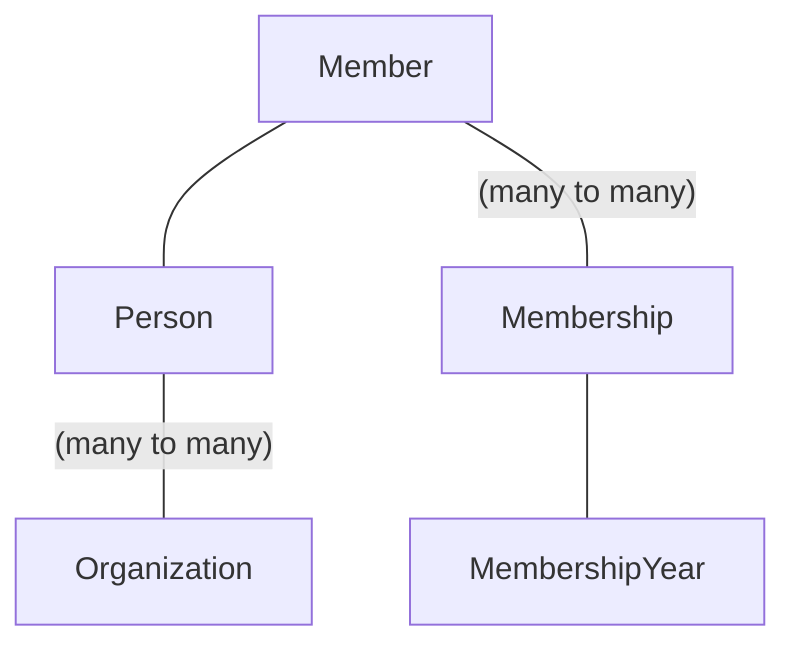

# Klynge Næringsforening – Membership and Organization setup

This repository contains [Klynge Næringsforening's _Sanity Studio_][studio]. In
this tool, we manage all memberships, including personal data such as name,
address, privacy options, membership status and organizations associated with
Klynge.

[studio]: https://studio.klyngeorg.no/

**Note**: When the relationship is not annotated, they are one-to-one
relationships.

The graph above shows the relationships between the data. The idea behind
`Member` is to hold the personal information (`Person`) and other
membership-related information (e.g. payment information).

`Person` can have multiple organizations connected to it to describe which
organization the person works for. `Member` can be connected to a company to
describe which organization should be invoiced for the membership.

A `Membership` describes if a `Member` has membership within a `MembershipYear`.
Where `MembershipYear` typically describes a year of membership.

## Basing data models of Schema.org

To promote standardization and normalization we build our schemas based on
[Schema.org][schema]. We are not fully implementing the schemas, but picking the
fields we need and in some cases adding new fields. One example is storing
information about privacy close to the data it concerns.

We are trying to closely comply with Schema.org schemas, we also benefit of
using these schemas when using [structured data][structured-data] in web
applications and the like. There's also a higher level of descriptions of our
data.

- `Person` is derived from [schema.org/Person](https://schema.org/Person)
- `Organization` is derived from
  [schema.org/Organization](https://schema.org/Organization)
- `Address` is derived from
  [schema.org/PostalAddress](https://schema.org/PostalAddress)
- `worksFor` is derived from [schema.org/worksFor](https://schema.org/worksFor)

[schema]: https://schema.org/
[structured-data]:
  https://developers.google.com/search/docs/appearance/structured-data/intro-structured-data

## Add new members

https://user-images.githubusercontent.com/3726815/216833303-7bf8812f-25df-4f39-9a68-2694419f7b6d.mov

**Prerequisite**: You'll need to have access to [studio], it's safe to assume
[someone with a board member role at Klynge][members] to have access and be able
to share that.

[members]: https://klyngeorg.no/about/members

To add new members, click on the _Medlem_ in the studio editor. Click the
document and pencil icon to add a new member. In this form, you'll see the given
and family name, e-mail, phone number, address and image. We only require the
given and family name, email and phone number.

**Note**: If the address and payee information is missing, we're not able to
send an invoice. If a profile image is missing _and_ the information is made
publicly available, we use Gravatar to resolve that (or default to a default
image).

With a `Member` created, we only have stored the information, but we haven't
added a _membership_ to it. To add a membership, go to _Medlemskap_ and click
the add button where you'll refer the member you recently created. You should
leave the status field as the default value (_Venter_).

## Other links

GraphQL is available here:
https://95rc74zt.api.sanity.io/v1/graphql/production/default

**Note**: You will need an API token to access data.
